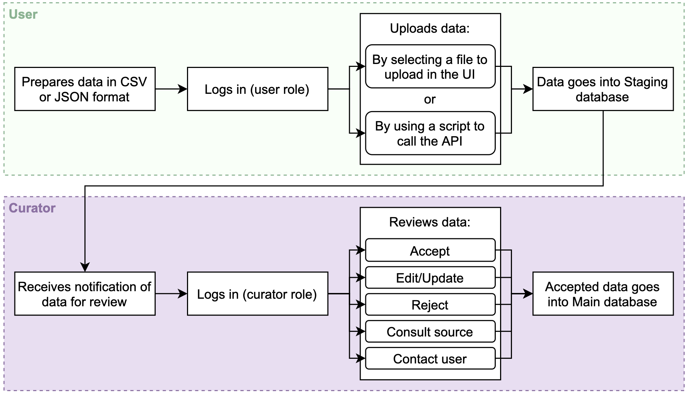

# Curation in the CPD

All data uploaded to the CPD undergoes a curation process to ensure quality and conformity with the CPD data standards.

## The curation process

Curation in the CPD follows the process below, in which user-uploaded data is added to a staging database awaiting curation (note: in v1.1.0, only the scripted API upload method is available, not the UI-based upload).

After new data is uploaded and awaiting curation, authorized curators receive periodic notifications of data for review. The curator then logs in and reviews the data, accepting entries that don’t require changes, editing or rejecting entries that have issues, and consulting the publication source and/or the uploader when needed. If a data entry is rejected, the curator will notify the user who uploaded the data indicating what changes are necessary for the data to be accepted to the CPD.

We expect that the data curation process will evolve over time, particularly as more data is uploaded to the CPD. As initial uploads from external users occur, CPD curators will start with a rigorous approach in which each of the elements of a given data entry will be carefully cross-referenced with the associated peer-reviewed article. In addition, each data entry will be checked to ensure that formatting of each data element matches the established requirements for each data element. For larger data uploads (threshold to be determined, ca. 1,000–10,000 entries), the CPD team will require the user to contact and work with a CPD curator to discuss the data and formatting requirements to alleviate the burden on the curators to rigorously check each data entry one at a time.

## Become a curator

Want to help support the growth of the CPD and the use of data to accelerate catalyst R&D? Contact us at cpd@nrel.gov to discuss joining our team of curators.
