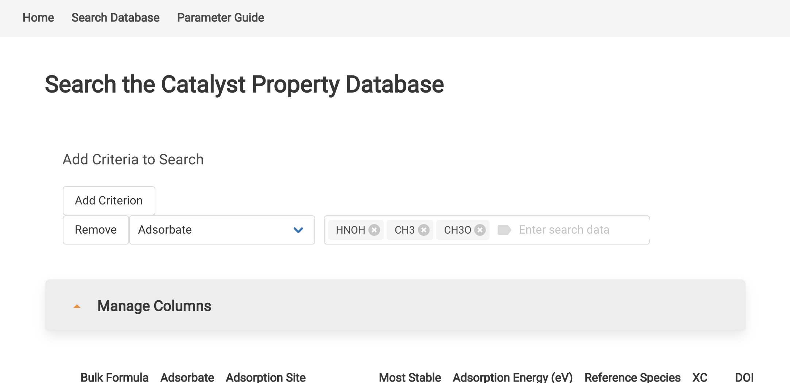
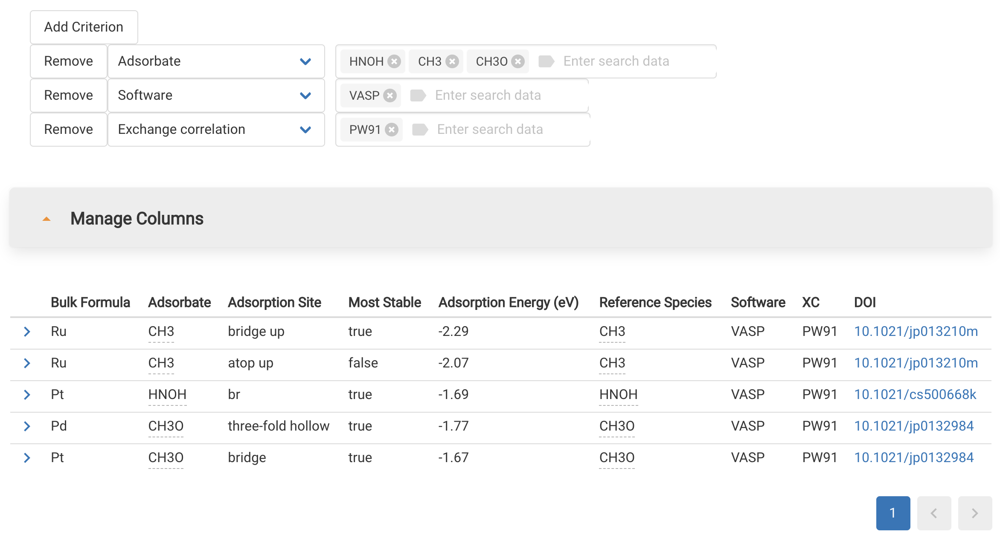
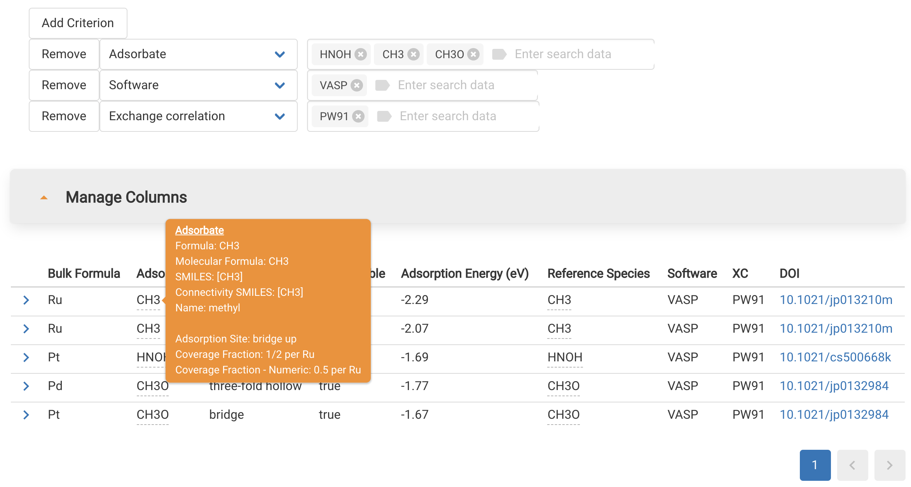
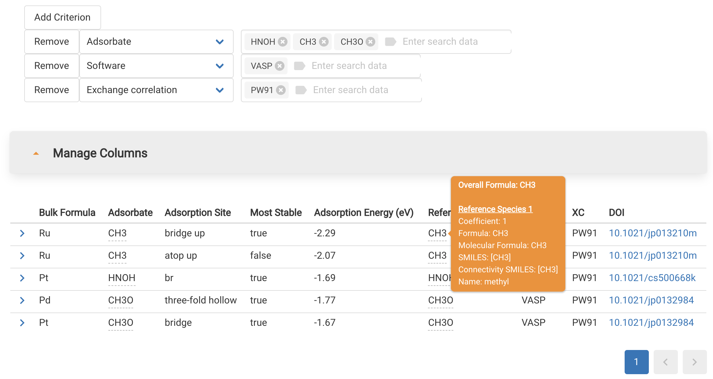

# Searching the CPD

## Searching

Start a database search from the CPD homepage by clicking "Search Database" or going to https://cpd.chemcatbio.org/search_database.

### Add Search Criteria

Add criteria to your search by clicking the "Add Criterion" button. Select the criterion you want using the "Select a criterion" dropdown. See the [CPD Quick Guide](https://cpd.chemcatbio.org/parameter-guide) or [Parameter Guide](/parameter-guide) section of this site for an explanation of each parameter that can be added as a search criterion.

_Example of adding an Adsorbate="HNOH" search criterion:_
TODO: add_criterion

For many criteria, such as Adsorbate, you can continue adding multiple entries from the dropdown list. The CPD will return results matching ANY of the entries entered within a single criterion.

_Example of multiple entries for the Adsorbate criterion:_

### Live Updating

As you add criteria to your search, the results list will update live, giving you rapid feedback on whether you are finding the results you need.

### Adding More Criteria

You can add as many criteria as you like. The CPD will return all results that match ALL of your criteria.

_Example of multiple search criteria:_

### Removing Criteria

Remove any criterion by clicking the "Remove" button.

### Clearing the Search

To remove all criteria and start over, simply reload the page.

## Reviewing Results

Results from your search can be reviewed on the same page.

_Example of results list for the multiple criteria search above:_

### Adsorbate and Reference Details

You can view details on the adsorbate species and gas-phase reference species set by hovering over those entries in the results table.

_Example of adsorbate species preview:_

_Example of reference species set preview:_

### Detail View

You can view all of the info for a particular row of the results table by clicking the detail view icon on the left.

_Loading the detail view:_

TODO: detail video

### Manage Columns

You can choose which columns you want to see in the results table by clicking the Manage Columns feature.

_Example of editing columns using the Manage Columns feature:_

TODO: manage columns

1090 x 625
